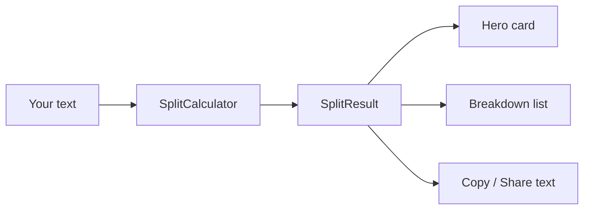

<div align="center">
  

# Rupee Splitter

**Split any rupee amount into as many ₹1,999 portions as possible — plus the exact remainder.**

Fast · Private · 100% offline · No account · No internet · No ads

[Features](#features) · [How it works](#how-it-works) · [Build and run](#build-and-run) · [Testing](#testing)

</div>

---

## What it does

Type an amount. Rupee Splitter shows how many **₹1,999** portions fit inside it and what is left over.

```text
                       ₹10,000
                          │
              ┌───────────┴───────────┐
              ▼                       ▼
        ₹1,999 × 5                  ₹5 × 1
       (5 full parts)           (remainder)
```

It is a **neutral payment-planning calculator**. It only does arithmetic. It does **not** claim that splitting a payment changes tax, fees, bank rules, UPI rules, legal obligations or regulatory requirements.

## Examples

| You enter | ₹1,999 portions | Remaining | Total parts |
| --- | --- | --- | --- |
| ₹1,999 | 1 | ₹0 | 1 |
| ₹2,000 | 1 | ₹1 | 2 |
| ₹10,000 | 5 | ₹5 | 6 |
| ₹10,000.50 | 5 | ₹5.50 | 6 |
| ₹1,00,00,000 | 5,002 | ₹1,002 | 5,003 |

Every result satisfies the reconciliation rule:

```text
portions × ₹1,999  +  remaining  ==  original amount
```

The unit tests assert this for every successful split.

## Features

- **Exact arithmetic** — all money is converted to integer *paise* and split with `BigInteger`. No floating-point errors, ever.
- **Indian number formatting** — `1,00,000`, `1,00,00,000`, decimals up to 2 places.
- **Live results** — the answer updates as you type.
- **Quick amounts** — one tap for ₹1,999 … ₹1,00,000.
- **Copy & Share** — plain-text breakdown for any app.
- **Clear states** — empty, zero, invalid and success each have their own screen.
- **Light & dark themes** — follows your system setting; tap the sun/moon button in the header to override.
- **Smooth UI** — Material 3, 250 ms fade-and-rise transitions, ripple feedback.
- **Large-amount safe** — lists are capped so even a ₹10¹⁰⁰ amount stays fast.
- **Accessible** — labelled controls, content descriptions, live-region announcements.
- **Offline & private** — **zero permissions**, no internet, no analytics, no account. The only thing the app
  stores is your light/dark choice, and that one setting is the only thing included in Android backups and
  device transfers. Amounts you type are never saved.

## How it works

1. The text you type is cleaned (spaces and the optional `₹` removed).
2. It must match an Indian amount pattern: `12345.67` or `1,23,456.78`.
3. It is converted to paise and divided exactly:

```kotlin
CHUNK_PAISE = 199_900              // ₹1,999 in paise

val paise   = BigDecimal("10000.50").movePointRight(2)   // 1_000_050
val (portions, remainder) = paise.divideAndRemainder(CHUNK_PAISE)
// portions = 5, remainder = 550  →  5 × ₹1,999 + ₹5.50
```

4. A single `SplitResult` drives every screen, the copy text and the share text.



---

## Build and run

### Requirements

| Tool | Version | Notes |
| --- | --- | --- |
| [Android Studio](https://developer.android.com/studio) | Latest stable | Bundles the JDK that Gradle uses — **no separate JDK install needed** |
| [Android SDK](https://developer.android.com/studio/releases/platforms) | Platform 37 | `compileSdk = 37` |

### Open and build

```bash
git clone https://github.com/SaikatAich2000/RupeeSplitter.git
cd RupeeSplitter
./gradlew assembleDebug        # Windows: .\gradlew.bat assembleDebug
```

### Run in Android Studio

1. **File → Open** and select the project folder, then wait for the Gradle sync to finish.
2. Pick a device in the toolbar: an emulator from **Device Manager**, or a phone with USB debugging on.
3. Press **Run ▶**.

### Create an APK

**Debug APK** (for trying it on your own phone): **Build → Generate App Bundles or APKs → Generate APKs**
(older versions: **Build → Build Bundle(s) / APK(s) → Build APK(s)**), or `./gradlew assembleDebug`.
Output: `app/build/outputs/apk/debug/app-debug.apk`.

**Signed release APK** (for sharing): **Build → Generate Signed App Bundle or APK → APK**, create or choose a
keystore, select **release** and finish. Output: `app/release/app-release.apk`. Keep the keystore safe; every
future update must be signed with the same one.

### Signed release build from the command line

From the command line, with a keystore you already have:

```bash
KEYSTORE_PATH=/path/to/key.jks KEYSTORE_PASSWORD=... KEY_ALIAS=... KEY_PASSWORD=... \
  ./gradlew assembleRelease
```

Without those variables the release build is unsigned and Android will refuse to install it.
Never commit a keystore.

## Testing

| Command | What it checks |
| --- | --- |
| `./gradlew testDebugUnitTest` | Splitting, parsing, formatting, reconciliation (JVM, no device) |
| `./gradlew lintDebug` | Android lint |
| `./gradlew connectedDebugAndroidTest` | UI tests on a running emulator or device |

Every calculation test also asserts `originalPaise == calculatedTotalPaise`, so the app can never invent or lose money.

### Coverage and SonarQube

Coverage instrumentation is off by default and switched on with `-Pcoverage`, so ordinary debug builds are unaffected.

```bash
# 1. Unit + instrumented coverage reports (needs a running emulator or device)
./gradlew -Pcoverage createDebugUnitTestCoverageReport createDebugAndroidTestCoverageReport lintDebug

# 2. Analysis, as a separate step so it reads the finished reports
SONAR_HOST_URL=http://localhost:9000 SONAR_TOKEN=<your token> ./gradlew -Pcoverage sonar
```

A local server is one command: `docker run -d --name sonarqube -p 9000:9000 sonarqube:community`. Create a project with
the key `rupee-splitter` and generate a token for it. The token is only ever passed on the command line; never commit it.

The project is kept at **0 open issues** and **above 95% coverage** (unit and instrumented reports combined).

### Dependencies

- Versions live in one place: `gradle/libs.versions.toml`.
- Every downloaded artifact is checked against the SHA-256 checksums in `gradle/verification-metadata.xml`.
  By default a mismatch is reported as a warning, so an IDE-only download can never break a sync. To make a
  tampered or swapped dependency fail the build, add `--dependency-verification strict` (recommended for release builds).
- After changing a version, refresh the checksums by re-running the tasks you use with the write flag, then review the
  diff before committing:

```bash
./gradlew --write-verification-metadata sha256 assembleDebug assembleRelease testDebugUnitTest lintDebug
```

## Project structure

```text
RupeeSplitter/
├── app/
│   ├── src/main/java/com/example/rupeesplitter/
│   │   ├── MainActivity.kt              # UI, animations, copy / share
│   │   ├── SplitCalculator.kt           # pure splitting logic + RupeeFormatter
│   │   └── BreakdownTextFormatter.kt    # copy / share plain text
│   ├── src/main/res/
│   │   ├── layout/                      # activity_main + result rows
│   │   ├── drawable/                    # logo, icons, gradients
│   │   ├── values/   values-night/      # colours, strings and themes
│   │   └── mipmap-*/                    # launcher icons (all densities)
│   ├── src/test/                        # unit tests
│   └── src/androidTest/                 # UI tests (Espresso)
├── gradle/
│   ├── libs.versions.toml               # dependency and plugin versions
│   └── verification-metadata.xml        # dependency checksums
└── README.md
```

## Performance

- Money is stored as `BigInteger` paise — exact and cheap.
- Results rebuild only when what is shown would change, not on every keystroke.
- Detailed lists stop at **100 rows**; bigger splits switch to a compact summary.
- Copy / share text stops at **200 rows**, then compacts.
- Release builds use **R8 minification + resource shrinking**.

## Accessibility

- Controls carry labels; decorative images are hidden from screen readers.
- Errors are announced through an accessibility live region.
- Touch targets are at least 48dp.
- Text respects the system font scale and text colours are chosen for readable contrast.

## Troubleshooting

| Problem | Fix |
| --- | --- |
| `Unsupported class file major version` | Gradle needs Java 17–27. Set **Settings → Build Tools → Gradle → Gradle JDK** to Android Studio's bundled JDK. |
| `SDK location not found` | Create `local.properties` with `sdk.dir=C:\path\to\Sdk`. |
| `Failed to find target with hash string 'android-37'` | Install **Android SDK Platform 37** in the SDK Manager. |
| `Cannot add extension with name 'kotlin'` | You applied `org.jetbrains.kotlin.android`. Remove it — AGP 9 already provides Kotlin support. |
| `Dependency verification failed` (strict mode) | A dependency changed or is new. If you changed it on purpose, refresh the checksums as described under [Dependencies](#dependencies). |

## License

Licensed under the [MIT License](LICENSE).

## Contributing

Keep it offline, dependency-light and covered by tests. Before opening a pull request, run:

```bash
./gradlew testDebugUnitTest lintDebug assembleDebug assembleRelease
```

`lintDebug` should report **No issues found** and every test must pass. With an emulator running, also run
`./gradlew connectedDebugAndroidTest`.
