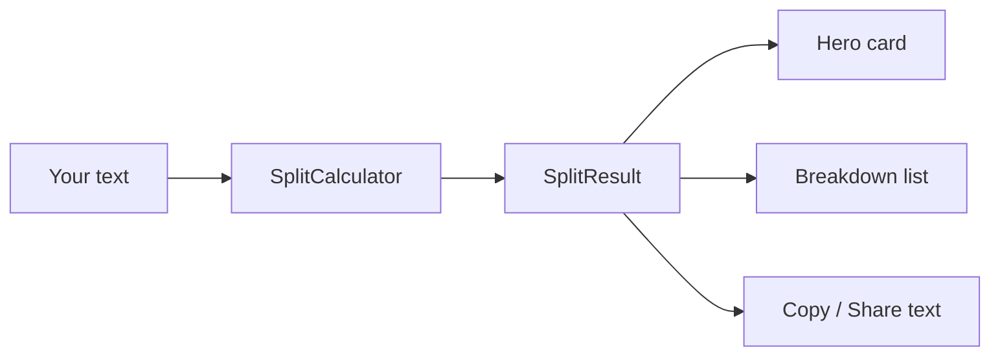

<div align="center">
  

# Rupee Splitter

**Split any rupee amount into as many ₹1,999 portions as possible — plus the exact remainder.**

Fast · Private · 100% offline · No account · No internet · No ads

[Features](#features) · [How it works](#how-it-works) · [Run it](#run-it) · [Testing](#testing) · [Docs](docs/ARCHITECTURE.md)

</div>

---

## What it does

Type an amount. Rupee Splitter shows how many **₹1,999** portions fit inside it and
what is left over.

```text
                       ₹10,000
                          │
              ┌───────────┴───────────┐
              ▼                       ▼
        ₹1,999 × 5                  ₹5 × 1
       (5 full parts)           (remainder)
```

It is a **neutral payment-planning calculator**. It only does arithmetic. It does
**not** claim that splitting a payment changes tax, fees, bank rules, UPI rules,
legal obligations or regulatory requirements.

## Examples

| You enter | ₹1,999 portions | Remaining | Total parts |
| --- | --- | --- | --- |
| ₹1,999 | 1 | ₹0 | 1 |
| ₹2,000 | 1 | ₹1 | 2 |
| ₹10,000 | 5 | ₹5 | 6 |
| ₹10,000.50 | 5 | ₹5.50 | 6 |
| ₹1,00,00,000 | 5,002 | ₹1,002 | 5,003 |

Every result satisfies the reconciliation rule:

```text
portions × ₹1,999  +  remaining  ==  original amount
```

The unit tests assert this for every case.

## Features

- **Exact arithmetic** — all money is converted to integer *paise* and split with
  `BigInteger`. No floating-point errors, ever.
- **Indian number formatting** — `1,00,000`, `1,00,00,000`, decimals up to 2 places.
- **Live results** — the answer updates as you type.
- **Quick amounts** — one tap for ₹1,999 … ₹1,00,000.
- **Copy & Share** — plain-text breakdown for any app.
- **Clear states** — empty, zero, invalid and success each have their own screen.
- **Light & dark themes** — follows your system setting.
- **Smooth UI** — Material 3, 250 ms fade-and-rise transitions, ripple feedback.
- **Large-amount safe** — lists are capped so even a ₹10¹⁰⁰ amount stays fast.
- **Accessible** — labelled controls, content descriptions, live-region announcements.
- **Offline & private** — **zero permissions**, no internet, no analytics, no account.
  See [docs/PRIVACY.md](docs/PRIVACY.md).

## How it works

1. The text you type is cleaned (spaces and the optional `₹` removed).
2. It must match an Indian amount pattern: `12345.67` or `1,23,456.78`.
3. It is converted to paise and divided exactly:

```kotlin
CHUNK_PAISE = 199_900              // ₹1,999 in paise

val paise   = BigDecimal("10000.50").movePointRight(2)   // 1_000_050
val (portions, remainder) = paise.divideAndRemainder(CHUNK_PAISE)
// portions = 5, remainder = 550  →  5 × ₹1,999 + ₹5.50
```

4. A single `SplitResult` drives every screen, the copy text and the share text.



Read more in [docs/ARCHITECTURE.md](docs/ARCHITECTURE.md).

---

## Run it

### Option A — Android Studio (easiest)

1. Install the stable **Android Studio** from the official Android developer site.
2. Install **JDK 17** (e.g. Eclipse Temurin 17).
3. In **More Actions → SDK Manager**, install **Android 15 / API 35**,
   **Build-Tools** and **Platform-Tools**.
4. **File → Settings → Build, Execution, Deployment → Build Tools → Gradle**:
   set **Gradle JDK** to your JDK 17.
5. **File → Open** and select this folder (`D:\Coding\RupeeSplitter`).
6. Wait for Gradle sync, then press **Run ▶**.

> The project uses Android Gradle Plugin 8.7.3 with Gradle 8.9, which need **JDK 17**.
> Do not point Gradle at a Java 25 runtime — Gradle 8.9 does not support it.

### Option B — Command line (Windows PowerShell)

```powershell
# 1. Tell Gradle which JDK to use (JDK 17)
$env:JAVA_HOME = "C:\Program Files\Eclipse Adoptium\jdk-17"

# 2. Build a debug APK
.\gradlew.bat assembleDebug

# 3. Run unit tests, Android lint and the build in one go
.\gradlew.bat testDebugUnitTest lintDebug assembleDebug
```

The wrapper downloads Gradle 8.9 automatically on the first run.

**Output:**

```text
app\build\outputs\apk\debug\app-debug.apk
```

Copy that APK to any Android phone to install it (allow installs from your file
manager when asked).

## Testing

| Command | What it checks |
| --- | --- |
| `.\gradlew.bat testDebugUnitTest` | Splitting, parsing, formatting, reconciliation |
| `.\gradlew.bat lintDebug` | Android lint, resource and API problems |
| `.\gradlew.bat assembleDebug` | Compiles and packages the APK |

The unit tests cover exact portions, remainders, decimals, zero, malformed input,
Indian grouping, very large amounts, copy/share text and exact total reconciliation.

Every test ends with:

```kotlin
assertEquals(result.originalPaise, result.calculatedTotalPaise)
```

That single assertion guarantees the app can never invent or lose money.

## Project structure

```text
RupeeSplitter/
├── app/
│   ├── src/main/java/com/example/rupeesplitter/
│   │   ├── MainActivity.kt              # UI, animations, copy / share
│   │   ├── SplitCalculator.kt           # pure splitting logic + RupeeFormatter
│   │   └── BreakdownTextFormatter.kt    # copy / share plain text
│   ├── src/main/res/
│   │   ├── layout/                      # activity_main + result rows
│   │   ├── drawable/                    # logo, icons, gradients
│   │   ├── values/   values-night/      # colours, strings, sizes, themes
│   │   └── mipmap-*/                    # launcher icons (all densities)
│   └── src/test/                        # unit tests
├── docs/                                # architecture, privacy, brand
├── tools/generate_launcher_icons.ps1    # regenerates the app icon
└── README.md
```

## Performance

- Money is stored as `BigInteger` paise — exact and cheap.
- Results rebuild only when the split actually changes (a *signature guard*), not on
  every keystroke.
- Detailed lists stop at **100 rows**; bigger splits switch to a compact summary.
- Copy / share text stops at **200 rows**, then compacts.
- Release builds use **R8 minification + resource shrinking**.

## Accessibility

- Every control has a label and a content description.
- Errors are announced through an accessibility live region.
- Touch targets are at least 48dp.
- Text respects the system font scale and colours meet WCAG AA contrast.

## Troubleshooting

| Problem | Fix |
| --- | --- |
| `Unsupported class file major version 69` | Gradle is using Java 25. Set `JAVA_HOME` to a JDK 17. |
| `SDK location not found` | Create `local.properties` with `sdk.dir=C\:\\path\\to\\Sdk`. |
| `Build Tools revision ... is too low` | Install the Build-Tools version pinned in `app/build.gradle.kts`. |
| `style attribute not found` | Run `.\gradlew.bat clean`, then sync again. |

## Documentation

| File | What it covers |
| --- | --- |
| [docs/ARCHITECTURE.md](docs/ARCHITECTURE.md) | Layers, data flow, state machine, algorithms |
| [docs/PRIVACY.md](docs/PRIVACY.md) | The offline and privacy guarantee |
| [docs/BRAND.md](docs/BRAND.md) | Name, logo, colour palette, typography |

## Licence

Provided as-is for personal and educational use. Review it before shipping it to
production.

