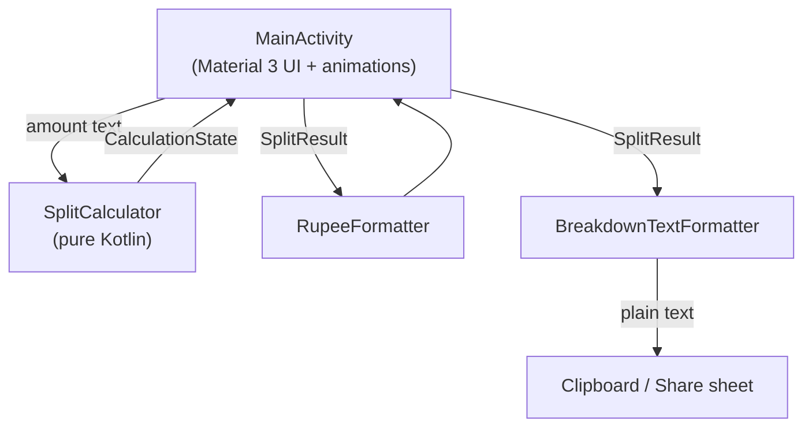
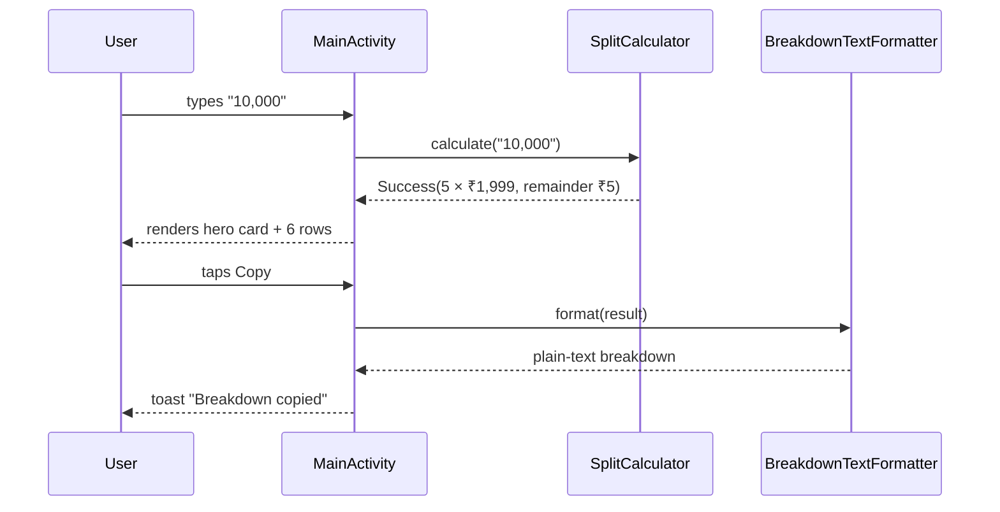
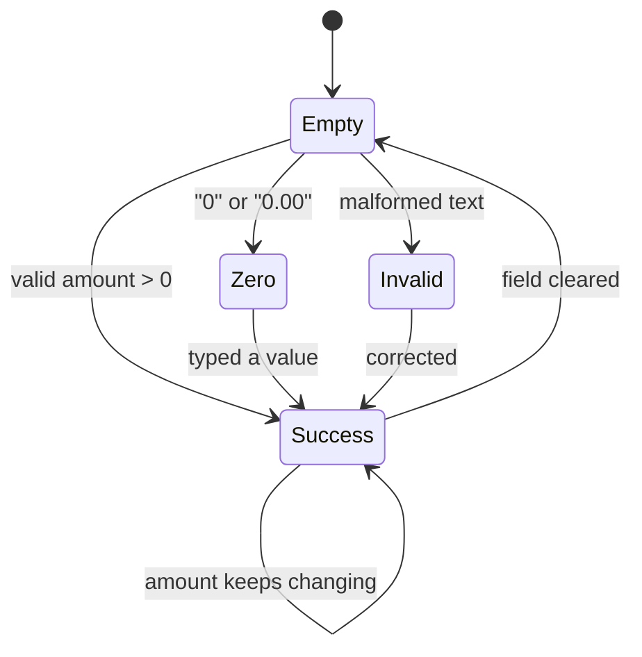

# Architecture

Rupee Splitter is deliberately small. Everything runs on the device and there is no
network layer at all. The design keeps **pure logic** apart from the **Android UI**,
so all the maths can be unit tested without an emulator.

## Layered view



## Responsibilities

| Layer | Files | Job |
| --- | --- | --- |
| Presentation | `MainActivity.kt`, `res/layout/*` | Draw state, run animations, capture input |
| Domain | `SplitCalculator.kt` | Parse text and split exactly with `BigInteger` |
| Formatting | `RupeeFormatter`, `BreakdownTextFormatter.kt` | Indian number format, copy/share text |
| Platform | Android SDK | Clipboard, share sheet, resources, theme |

Nothing in the Domain or Formatting layer imports an Android class, which is why the
unit tests run on the plain JVM.

## Data flow

1. The user types into `amountInput`.
2. `SplitCalculator.calculate(text)` returns a `CalculationState`.
3. `MainActivity` renders the matching view (placeholder, hero card, list).
4. Copy/Share turn the current `SplitResult` into text with `BreakdownTextFormatter`.



## State machine



`CalculationState` is a sealed interface with four members: `Empty`, `Zero`,
`Invalid` and `Success(result)`. Because it is sealed, the `when` blocks in the UI are
exhaustive and the compiler guarantees no case is forgotten.

## Why `BigInteger` and paise?

Money must never drift. Floating point (like `Double`) cannot represent `0.10`
exactly, so repeating arithmetic slowly produces wrong paise. Rupee Splitter converts
every amount to **integer paise** first:

```text
"10,000.50"  →  BigDecimal("10000.50")  →  movePointRight(2)  →  1,000,050 paise
```

Splitting is then exact integer division:

```kotlin
val (portions, remainder) = paise.divideAndRemainder(CHUNK_PAISE) // CHUNK_PAISE = 199900
```

No rounding, no drift, no floating-point surprises — even for amounts with 100+ digits.

## Performance notes

- **Signature guard.** The result view is only rebuilt when the split actually
  changes, not on every keystroke.
- **Bounded lists.** Up to 100 detailed rows are shown; very large splits switch to a
  compact summary so the UI never freezes.
- **Efficient parsing.** Pre-compiled `Regex` patterns avoid recompiling validation rules.
- **Lean dependencies.** Only AndroidX Core, AppCompat and Material
  are used — the release build is R8-minified and resource-shrunk.

## Testing strategy

| Test type | Location | Covers |
| --- | --- | --- |
| Unit | `app/src/test/java/...` | Splitting, parsing, formatting, reconciliation |
| Instrumented | `app/src/androidTest/java/...` | Launch and basic interaction |

Every successful-split test also asserts **reconciliation**: `portions × ₹1,999 + remainder == original`.
